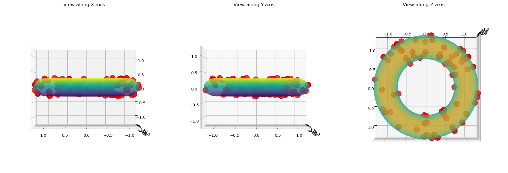

# Manifold Sampling

Sampling algorithms for probability distributions on manifolds using Riemannian geometry. Generates samples from arbitrary curves and surfaces by performing pullback on the input density.

$$
 \int_{\phi(U)} fdV = \int_U  f(\phi(x)) \det(\phi'(x)^T \phi'(x))^{1/2}dx_1\dots dx_k
$$

Sampling on $\mathbb{R}^k$ is done using rejection sampling with a uniform proposal distribution.
This is done under the assumption that pulled-back density is bounded.

<p align="center"></p>

## Usage

```python
from manifold import Manifold
import numpy as np

# Sample from ellipse
ellipse = Manifold(
    coords=lambda t: np.array([2*np.cos(t[0]), np.sin(t[0])]),
    pushforward=lambda t: np.array([[-2*np.sin(t[0])], [np.cos(t[0])]]),
    dim=1,
    bounds=[(0, 2*np.pi)]
)
samples = ellipse.sample(n_samples=100, M=2.5)
```

See `demo.ipynb` for more examples.

## Todo

- [ ] Move core logic to C++ backend and create R and Python libraries by FFIing.
- [ ] Write expository article about how this is done.