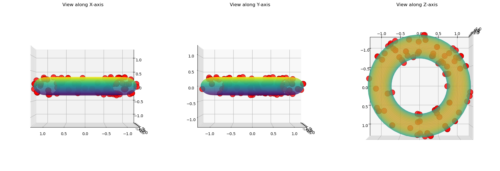

# Manifold Sampling

Sampling algorithms for probability distributions on manifolds using Riemannian geometry. Generates samples from arbitrary curves and surfaces by performing pullback on the input density.

$$
 \int_{\phi(U)} fdV = \int_U  f(\phi(x)) \det(\phi'(x)^T \phi'(x))^{1/2}dx_1\dots dx_k
$$

Sampling on $\mathbb{R}^k$ is done using rejection sampling with a uniform proposal distribution.
This is done under the assumption that the pulled-back density is bounded.

<p align="center"></p>

## Derivations

We want to uniformly sample random points from a compact orientable $k$-dimensional submanifold $M$ of
$\mathbb{R}^n$. Throughout this section I will assume that $\varphi : U \to M$ is an _almost everywhere_
coordinate system for $M$. By this I mean that $\varphi(U) \subset M$ and $M - \varphi(U)$ has measure zero in
$M$. According to [this MathOverflow post](https://mathoverflow.net/questions/177653/does-every-compact-manifold-exhibit-an-almost-global-chart?utm_source=chatgpt.com) such a parametrization always exists.

Lets consider the special case of sampling from curves. A natural approach would be to parametrize
the curve by $\alpha : [0,1] \to \mathbb{R}^3$, sample from $[0,1]$ uniformly, then pass those points
from $\alpha$ to obtain points on the curve. This doesn't work, however, as there will be more points
placed around those parts of the curve at which the parametrization moves slower. This issue can be
resolved if we use the arclength parametrization $\alpha : [0,L] \to \mathbb{R}^3$, where $L$ is the
length of the curve.

The generalization of this notion to higher dimensions is the _volume-preserving_ parametrization. A
coordinate system $\psi$ is volume preserving if it pulls back the volume form of $M$ into the volume
form of $\mathbb{R}^k$

$$
\psi^*dV = dx_1\cdots dx_k.
$$

Evidently, not all coordinate systems are volume-preserving; however, given an arbitrary coordinate
system $\varphi$, we can hope to find a change of coordinates $\theta$ such that
$\varphi \circ \theta$ is volume-preserving. In general, $\varphi^*dV = f dx_1\cdots dx_k$
for some function $f$. Thus

$$
(\varphi\circ\theta)^{\*}dV = \theta^{\*}(\varphi^{\*}dV) = (f\circ\theta)\theta^{\*}(dx_1\cdots dx_k) = (f\circ\theta) |\det \theta'|dx_1\cdots dx_k
$$

must be equal to $dx_1\wedge\cdots\wedge dx_k$. That is, $\theta$ is the solution to the following
PDE

$$
(f\circ\theta) |\det \theta'| = 1
$$

which is a Monge-Ampere type PDE if you assume that $\theta = u'$ for some function $u$. You can check that in one dimension this PDE is equivalent to the ODE for the arclength parametrization.
I did not have much luck with numerically solving this equation, so I began looking for alternative
approaches.

The second approach I came up with was much simpler than the first, and I am surprised that I didn't
think of it first. As before suppose that our manifold is parametrized by the coordinate
system $\varphi : U \to M$ which pulls the volume form back to $\varphi^*dV = fdx_1\cdots dx_k$.
Sample a point $X$ from $U$ using the (possibly unnormalized) density $f$. I claim that $\varphi(X)$
will follow the uniform distribution on $M$. That is because

$$
P(\varphi(X) \in B) = P(X \in \varphi^{-1}B) = \int_{\varphi^{-1}B} f = \int_B dV
$$

where the first equality follows because $\varphi$ is 1-1 and the last follows from the
fact that $\varphi^*dV = f\,dx$.

The core computation that we need to perform is sampling from $f$. In the general case of a
Riemannian manifold with a metric $(g_{ij})$, we will have that $f = \sqrt{\det g}$. For the
purposes of this project, I am assuming that the metric is induced by the inner product on
$\mathbb{R}^k$; in which case $g(x) = \varphi'(x)^T \varphi'(x)$ and thus
$f(x) = \det(\varphi'(x)^T \varphi'(x))^{1/2}$. I have perfomed this sampling via the rejection
method under the following assumptions:

1. The parameter space $U$ is a bounded open rectangle. This is done to simplify the representation on the computer.
2. The coordinate system $\varphi : U \to M$ is an almost-everywhere parametrization. This reasonable assumption (see first paragraph) is made to avoid dealing with an atlas. In particular, since those points of the manifold that aren't in $\varphi(U)$ form a set of measure zero, no one will notice if the sampler ignores them.
3. The function $f$ is bounded on $U$. This is not the case in general (e.g., parametrizing $(0,1)$ using $\sqrt{x}$, in which case $f(x) = x^{-1/2}/2$ is not bounded), but will hold if $\varphi$ can be extended continuously to some compact set containing $U$. I am not sure if this assumption is always compatible with (1), though I cannot produce a counterexample. I believe that it is reasonable.

Since $f$ is bounded on the rectangle $U$, then there is a constant $c$ such that $f \leq c\cdot\text{vol}(U)\cdot g$ where $g$ is the uniform density on $U$. This justifies
the use of rejection sampling for this purpose. Though the performance might not be so great for
very high-dimensional manifolds.

## Transport Maps and Normalizing Flows

We can also approach the problem from a more explicit transport perspective. We have a uniformly 
distirbuted random variable $Z$ and we wish to obtain a map $T$ such that the density $f_X$ of
$X = T(Z)$ is the same as $f$ (i.e., the pullback of the volume form in coordinates). We can find 
such a $T$ (i.e., obtain an approximate solution to the Monge-Ampere equation) by minimizing the
KL-divergence between $f_X(x) = 1/\det T'(T^{-1}(X))$ and $f$, which is

$$
\text{KL}(f_X \parallel f) = -E[\log\det T'(Z)] - E[\log f(T(Z))].
$$

This method is implemented in `saman_normalizing_flows.ipynb`. 

## Compilation

To compile python bindings run `make python`. To compile C++ demos run `make ellipse` or `make torus`.

To install the R package:

```bash
cd src/R
R CMD INSTALL .
```

## Usage

See [demo.ipynb](demo.ipynb) for detailed examples and applications
to Monte Carlo integration and estimating the mean Hausdorff distance
between compact manifolds.

### Python

```python
from saman import Manifold
import numpy as np

class Ellipse(Manifold):
    def __init__(self):
        super().__init__(2, 1, 2.5, np.array([0.0]), np.array([2.0 * np.pi]))

    def coord(self, t):
        return np.array([2*np.cos(t[0]), np.sin(t[0])])

    def pushforward(self, t):
        return np.array([[-2*np.sin(t[0])], [np.cos(t[0])]])

ellipse = Ellipse()
samples = ellipse.sample(n_samples=100)
```

### R

```r
library(saman)

coord = function(t) c(2 * cos(t[1]), sin(t[1]))
pushforward = function(t) matrix(c(-2 * sin(t[1]), cos(t[1])), 2, 1)

ellipse = saman.manifold(2, 1, 2.5, c(0), c(2*pi), coord, pushforward)
samples = ellipse$sample(100)
```

### C++

If you want to work with C++ directly see the [examples/](src/example/) folder.

## Todo

- [x] Move core logic to C++
- [x] Create python bindings
- [x] Create R bindings
- [x] Demo library by computing mean Hausdorff distance.
- [x] Write expository article about how this is done. (see [here](https://oktagonia.github.io/archive/saman.html))
